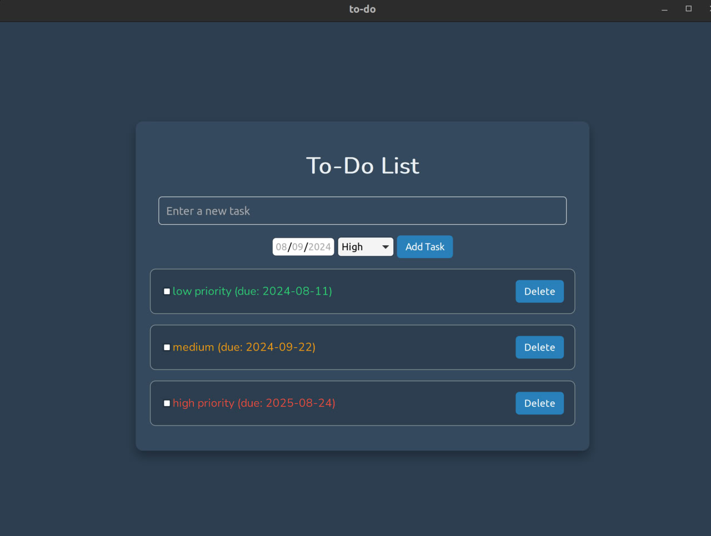

# To-Do List Application



This is a simple To-Do List desktop application built using the [Wails](https://wails.io/) framework. The application allows users to create, view, mark as completed, and delete tasks. The state of the tasks is saved in an SQLite database, ensuring persistence between sessions.

## Features

- **Add Tasks**: Users can add new tasks with a priority level and optional due date.
- **View Tasks**: All tasks are displayed in a list, with completed tasks styled differently.
- **Mark as Completed**: Tasks can be marked as completed, moving them to a separate section.
- **Delete Tasks**: Users can delete tasks from the list.
- **Persistent Storage**: Tasks are stored in an SQLite database, so they are saved even after closing the application.
- **Priority Levels**: Tasks can be assigned a low, medium, or high priority, indicated by different colors.
- **Responsive UI**: The interface is designed to be user-friendly and visually appealing.

## Installation

### Prerequisites

- [Go](https://golang.org/dl/) (1.21 or later)
- [Node.js](https://nodejs.org/) (21.x or later)
- [Wails CLI](https://wails.io/docs/gettingstarted/installation)

### Clone the Repository

```bash
git clone https://github.com/Gontafi/todo_wails_go
cd todo_wails_go
```

### Install Dependencies

Install Go and Node.js dependencies:

```bash
wails build -clean
```

to ensure that all dependencies installed:

```bash
wails doctor
```
### Running the Application

To run the application in development mode:

```bash
wails dev
```

To build the application for production:

```bash
wails build
```

The built application can be found in the `./build/bin` directory.

## Usage

- **Adding a Task**: Use the input field to enter a task name, select a priority, and optionally set a due date. Click "Add Task" to add it to the list.
- **Marking a Task as Completed**: Click the checkbox next to a task to mark it as completed. Completed tasks will appear crossed out.
- **Deleting a Task**: Click the "Delete" button next to a task to remove it from the list.
- **Viewing Tasks**: All tasks, including their priority and due date, are displayed in the main window.

## Technologies Used

- **Go**: Backend logic and interaction with SQLite database.
- **Svelte**: Frontend framework for building the user interface.
- **SQLite**: Lightweight, file-based database for storing tasks.
- **Wails**: Framework for building desktop applications using Go and web technologies.

## Contributing

Contributions are welcome! Please fork the repository, make your changes, and submit a pull request.

## License

This project is licensed under the MIT License. See the [LICENSE](LICENSE) file for details.

## Acknowledgements

- [Wails](https://wails.io/)
- [Svelte](https://svelte.dev/)
- [SQLite](https://www.sqlite.org/index.html)

---

Feel free to customize this `README.md` to better fit your project, especially the sections like "Contributing" and "Acknowledgements".